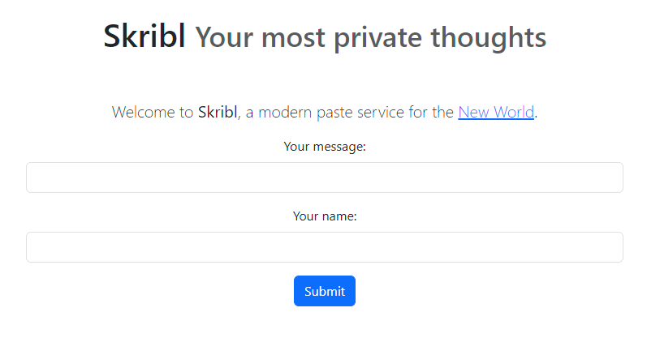
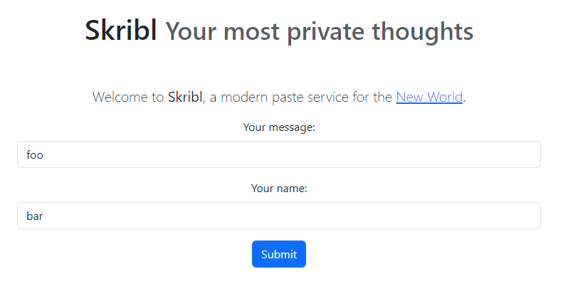
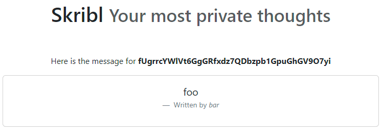

# SKRIBL - rene

The modern paste service for the New World.

https://skribl.chall.pwnoh.io

- [SKRIBL - rene](#skribl---rene)
- [Introduction](#introduction)
- [Application Overview](#application-overview)
- [Challenge](#challenge)
  - [Important Note](#important-note)
  - [Download \& Unzip](#download--unzip)
  - [Unzipped and Afraid](#unzipped-and-afraid)
    - [Dockerfile](#dockerfile)
      - [Trip down docker lane](#trip-down-docker-lane)
    - [Python](#python)


# Introduction

Skribl was an interesting challenge that involved a web application ran with Docker. The application used the [Flask](https://flask.palletsprojects.com/en/3.0.x/) framework.

# Application Overview



Skribl is a *modern paste service*. The app takes a `message` and an optional `author` and creates a `skribl` with that information:





The application stores created `skribl`s and creates a `key` for them. The `key` for our foo-bar `skribl` is: `fUgrrcYWlVt6GgGRfxdz7QDbzpb1GpuGhGV9O7yi`

The URL for this `skribl` is: `https://skribl.chall.pwnoh.io/view/fUgrrcYWlVt6GgGRfxdz7QDbzpb1GpuGhGV9O7yi`

From this, we can see that the url follows the format `/view/{key}`.

> This is information gathered without going into the source provided in the challenge.


# Challenge

## Important Note
This challenge can be solved without the use of a dedicated [virtual machine](https://en.wikipedia.org/wiki/Virtual_machine) (VM). All that is needed to solve this challenge is [python](https://www.python.org/), internet connection, and, arguably, a terminal.

I will be using an [Ubuntu](https://ubuntu.com/) 20.04 terminal running on [Windows Subsystem for Linux WSL2](https://learn.microsoft.com/en-us/windows/wsl/install). This means that I will be in a Windows host running Ubuntu through WSL2.

As mentioned previously, all you really need is a terminal and python (and internet connection, duh). Just know that all of the commands that I will provide throughout this write-up will be for specific to Ubuntu.

## Download & Unzip

The challenge provides a `.zip` file `dist.zip`. The very first step to start this challenge is to unzip the file. For that, we will use `unzip`.

More than likely, your machine should come with the `unzip` utility pre-installed. If not, install it with:

```bash
sudo apt update
sudo apt install unzip
```

Now that we have unzip, `unzip`-away your `dist.zip`-worries:

```bash
unzip /path/to/dist.zip
```

After decompressing the `ZIP` archive, we should get a `dist` directory with a lot of goodies (I hope) inside:
```
dist
├── Dockerfile
├── chal
│   ├── __init__.py
│   ├── __pycache__
│   │   ├── __init__.cpython-313.pyc
│   │   ├── backend.cpython-313.pyc
│   │   └── skribl.cpython-313.pyc
│   ├── setup.py
│   ├── skribl.py
│   └── templates
│       ├── about.html
│       ├── base.html
│       ├── index.html
│       └── view.html
└── requirements
    └── prod.txt

4 directories, 12 files
```

## Unzipped and Afraid
Wow! a [Dockerfile](https://docs.docker.com/engine/reference/builder/)? Python? What a jump scare...

Now that we have our unzipped challenge, we can take a few avenues to navigate it. How about starting from the Dockerfile?

### Dockerfile
If you are not familiar with Docker, allow me to present you Docker's beloved only child (without [compose](https://docs.docker.com/compose/)) the `Dockerfile`:

```dockerfile
# Dockerfile

FROM debian:bookworm-slim@sha256:24c92a69df28b21676d721fe18c0bf64138bfc69b486746ad935b49cc31b0b91 as build

RUN apt update -y && apt upgrade -y && \
    apt-get install -y wget build-essential checkinstall libreadline-dev libncursesw5-dev libssl-dev libsqlite3-dev tk-dev libgdbm-dev libc6-dev libbz2-dev libffi-dev zlib1g-dev && \
    cd /usr/src && \
    wget https://github.com/python/cpython/archive/3538930d87e6bdd2bfffa3f674a62cc91d359d31.tar.gz && \
    tar -xzf 3538930d87e6bdd2bfffa3f674a62cc91d359d31.tar.gz && \
    cd cpython-3538930d87e6bdd2bfffa3f674a62cc91d359d31 && \
    ./configure --enable-optimizations && \
    make -j 8 && \
    make install

WORKDIR /app


FROM debian:bookworm-slim@sha256:24c92a69df28b21676d721fe18c0bf64138bfc69b486746ad935b49cc31b0b91 as prod

RUN apt update -y && apt upgrade -y && \
    apt-get install -y openssl

COPY --from=build /usr/local/bin/python3 /usr/local/bin/python3.13 /usr/local/bin/
COPY --from=build /usr/local/lib/python3.13 /usr/local/lib/python3.13

WORKDIR /app

COPY requirements/prod.txt prod.txt
RUN python3 -m pip install -r prod.txt

COPY chal/ /app/

RUN python3 -m pip install .

ENV FLAG "bctf{fAk3_f1@g}"
CMD gunicorn -b 0.0.0.0 skribl:app
```

Intimidating, I know. Fret not! We will dissect this file in the following sections, but, before we do, we can see an interesting line in that file:

```docker
ENV FLAG "bctf{fAk3_f1@g}"
```

Keep it in mind for now.

#### Trip down docker lane

We can separate this file into two sections, the first one being:

```dockerfile
FROM debian:bookworm-slim@sha256:24c92a69df28b21676d721fe18c0bf64138bfc69b486746ad935b49cc31b0b91 as build

RUN apt update -y && apt upgrade -y && \
    apt-get install -y wget build-essential checkinstall libreadline-dev libncursesw5-dev libssl-dev libsqlite3-dev tk-dev libgdbm-dev libc6-dev libbz2-dev libffi-dev zlib1g-dev && \
    cd /usr/src && \
    wget https://github.com/python/cpython/archive/3538930d87e6bdd2bfffa3f674a62cc91d359d31.tar.gz && \
    tar -xzf 3538930d87e6bdd2bfffa3f674a62cc91d359d31.tar.gz && \
    cd cpython-3538930d87e6bdd2bfffa3f674a62cc91d359d31 && \
    ./configure --enable-optimizations && \
    make -j 8 && \
    make install

WORKDIR /app
```

`FROM` - All this does is grab a `Debian Bookworm Slim`, a lightweight version of the Debian operating system, image from [dockerhub](https://docs.docker.com/docker-hub/)(place where a lot of images reside) and then gives this part of the process a label of `build`

```docker
FROM debian:bookworm-slim@sha256:24c92a69df28b21676d721fe18c0bf64138bfc69b486746ad935b49cc31b0b91 as build
```

The next command, `RUN`, installs a lot of packages as well as going into the python repository and installs python from source.

```docker
RUN apt update -y && apt upgrade -y && \
    apt-get install -y wget build-essential checkinstall libreadline-dev libncursesw5-dev libssl-dev libsqlite3-dev tk-dev libgdbm-dev libc6-dev libbz2-dev libffi-dev zlib1g-dev && \
    cd /usr/src && \
    wget https://github.com/python/cpython/archive/3538930d87e6bdd2bfffa3f674a62cc91d359d31.tar.gz && \
    tar -xzf 3538930d87e6bdd2bfffa3f674a62cc91d359d31.tar.gz && \
    cd cpython-3538930d87e6bdd2bfffa3f674a62cc91d359d31 && \
    ./configure --enable-optimizations && \
    make -j 8 && \
    make install

WORKDIR /app
```
Lastly, it sets the working directory in the container to `/app`.

All this does is grabbing Debian and installing python, but what about the next section?

```docker
FROM debian:bookworm-slim@sha256:24c92a69df28b21676d721fe18c0bf64138bfc69b486746ad935b49cc31b0b91 as prod

RUN apt update -y && apt upgrade -y && \
    apt-get install -y openssl

COPY --from=build /usr/local/bin/python3 /usr/local/bin/python3.13 /usr/local/bin/
COPY --from=build /usr/local/lib/python3.13 /usr/local/lib/python3.13

WORKDIR /app

COPY requirements/prod.txt prod.txt
RUN python3 -m pip install -r prod.txt

COPY chal/ /app/

RUN python3 -m pip install .

ENV FLAG "bctf{fAk3_f1@g}"
CMD gunicorn -b 0.0.0.0 skribl:app
```

Here we're doing relatively the same thing first; grabbing an image and labeling this process "prod". After that, we install packages and copy files from our `build` process, AKA what we did in the above section, and paste it in this new container.

```docker
COPY requirements/prod.txt prod.txt
RUN python3 -m pip install -r prod.txt

COPY chal/ /app/

RUN python3 -m pip install .

ENV FLAG "bctf{fAk3_f1@g}"
CMD gunicorn -b 0.0.0.0 skribl:app
```

In this last part we copy the project source from our directory into the container, run `python3 -m pip install` in the container to install dependencies, and, lastly, run the application after setting an environment variable `FLAG` in the container.

Unfortunately for us, this is not the real flag. :(

HOWEVER! Now we know that there is an environment variable `FLAG` in the container running the web application.

### Python
Dockerfiles are cool and all, but let's go back to our safe place with python.

We got quite a bit of python files:

```
├── chal
│   ├── __init__.py
│   ├── __pycache__
│   │   ├── __init__.cpython-313.pyc
│   │   ├── backend.cpython-313.pyc
│   │   └── skribl.cpython-313.pyc
│   ├── setup.py
│   ├── skribl.py
│   └── templates
│       ├── about.html
│       ├── base.html
│       ├── index.html
│       └── view.html
```